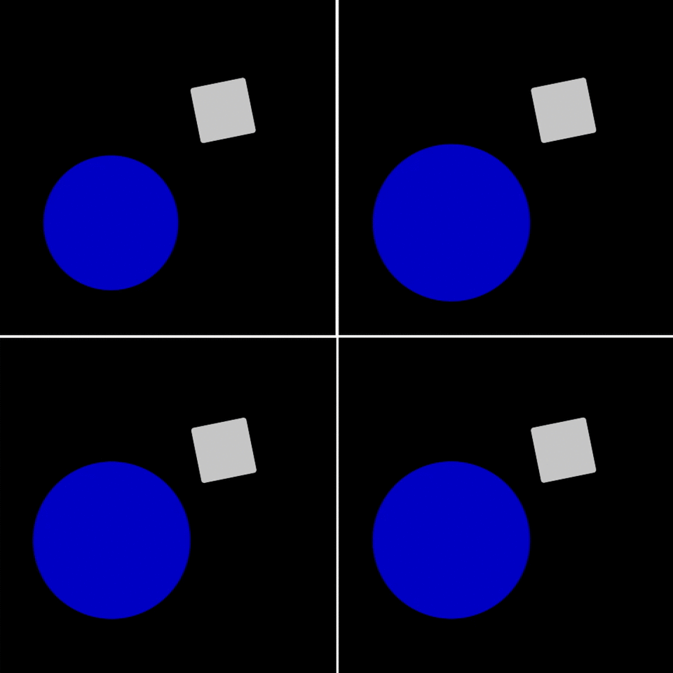

# Fluid-Rigid Coupling in a Variational Framework

 The implementation of 2D strong two-way fluid-solid coupling in the variational framework, based on the paper by Batty titled ["A fast variational framework for accuratesolid-fluid coupling"](https://dl.acm.org/doi/abs/10.1145/1276377.1276502). The simulation part is implemented in `C++`, with rendering part handled by `OpenCV`.

## Demo

<figure align="center">

<figcaption>(120 x 120 grid cells)</figcaption>
</figure>

## Usage

This project is a cross-platform project based on `CMake`, which will automate the entire pipeline (simulation + rendering), making it easy to compile and run. The commands given below are for `Linux`; the operations on `Windows` are similar (Visual Studio is recommended).


```bash
#install OpenCV
sudo apt update
sudo apt install libopencv-dev

git clone https://github.com/RYQ-22/FluidRigidCoupling2D.git
cd ./FluidRigidCoupling2D
mkdir build
cd ./build
cmake ..
make
./FluidSim
```

After running `FluidSim`, the output video `output.avi` can be found in the `build` folder. Settings for related parameters can be modified by editing the `main.cpp` file.

## Implementation in 3D

The implementation in 3D is [here](https://github.com/RYQ-22/FluidRigidCoupling3D), which needs some improvements to update the "level set".

